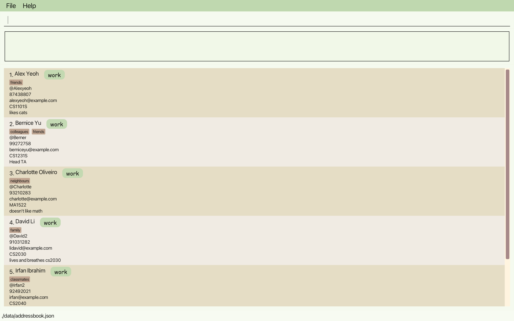
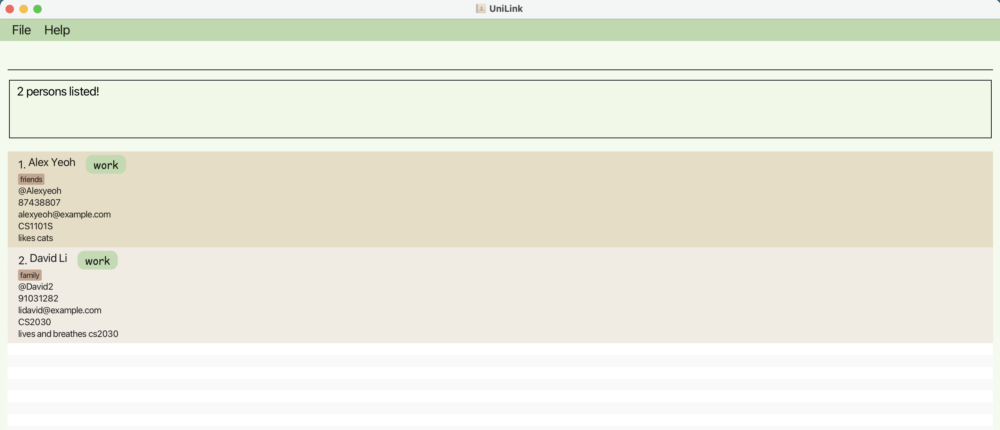
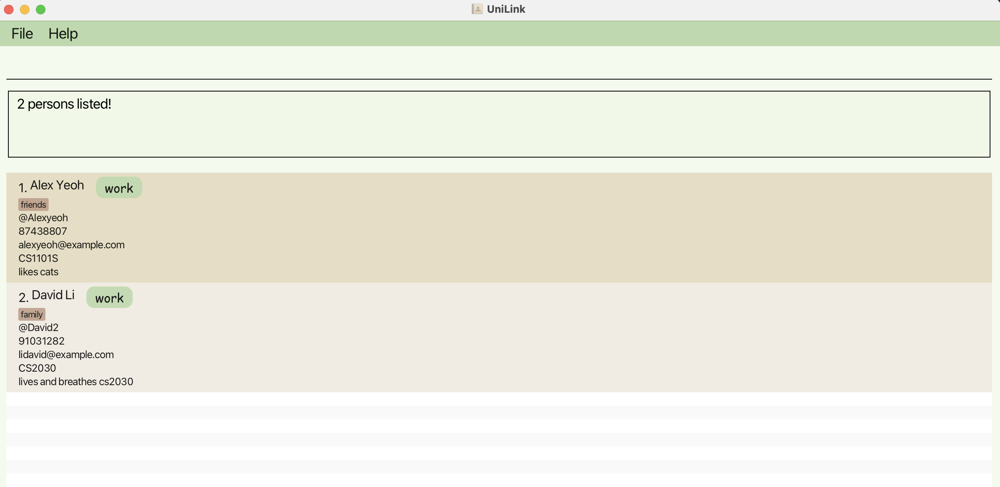
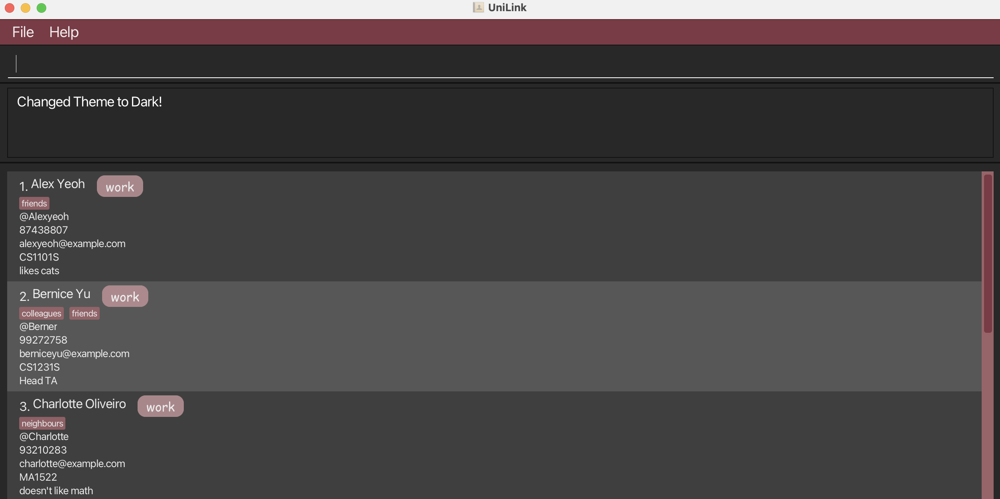
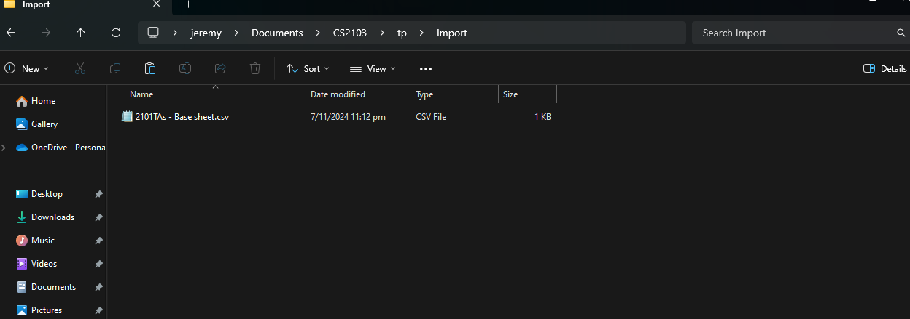

# UniLink User Guide

UniLink is a desktop app that allows university students to manage their contacts. With UniLink, students can categorise
their contacts into 'work', 'personal' and 'school' contacts to better manage their lives!

## Table of Contents
- [Quick Start](#quick-start)
- [Features](#features)
  - [Viewing help](#viewing-help--help)
  - [Adding a person](#adding-a-person--add)
  - [Editing a person](#editing-a-person--edit)
  - [Finding persons by name](#finding-persons-by-name--find)
  - [Finding persons by telegram handle](#finding-persons-by-telegram-handle--findtele)
  - [Finding persons by tags](#finding-persons-by-tags--findtag)
  - [Filtering persons by contact type](#filtering-persons-by-contact-type--filter)
  - [Deleting a person](#deleting-a-person--delete)
  - [Switching display theme](#switching-display-theme--switch)
  - [Importing data](#)
  - [Exiting the program](#exiting-the-program--exit)
- [FAQ](#faq)
- [Known Issues](#known-issues)
- [Command Summary](#command-summary)

<page-nav-print />

--------------------------------------------------------------------------------------------------------------------

## Quick start

**1. Set up Java**
- Ensure you have Java `17` or above installed in your Computer.
- Not sure? Open up Command Prompt (for Windows) or Terminal (for Mac) and type `java -version` to check.
- Download Java [[here](https://www.oracle.com/java/technologies/javase/jdk17-archive-downloads.html)] if needed.

**2. Download UniLink**
- Download the latest `.jar` file from [here](https://github.com/AY2425S1-CS2103T-W12-3/tp/releases).

**3. Choose a Home Folder**
- Move the `.jar` file to where you want to store your UniLink data. This will be your 'home folder'.

**4. Launch the app!**
- Open up Command Prompt (for Windows) or Terminal (for Mac) and navigate to the home folder with `cd path-to/folder`
    - E.g. If my jar file is in a folder called 'Contacts' in a folder called 'Uni' on my Desktop, I can navigate to it with `cd Desktop/Uni/Contacts`
- Run UniLink by typing `java -jar UniLink.jar`
- The app should open within a few seconds, showing some sample data that you can explore! 

- **Using the Command Line**: New to the command line? Check out this [Command Line for Beginners](https://www.freecodecamp.org/news/command-line-for-beginners/) guide!

**5. Try out some commands**
- Type commands in the command box and press Enter to execute it. Here are some commands to get you started:

   * `list` : Lists all contacts.

   * `add n/John Doe h/@johndoe ct/work` : Adds a contact named `John Doe` to the Address Book.

   * `delete 3` : Deletes the 3rd contact shown in the current list.

   * `clear` : Deletes all contacts.

   * `exit` : Exits the app.

1. For the full list of commands, refer to [Command Summary](#command-summary) below for more details of each command.

--------------------------------------------------------------------------------------------------------------------

## Features

<box type="info" seamless>

**Notes about the Command Format:** 

* Words in `UPPER_CASE` need to be provided by you. 
    * e.g. in `add n/NAME`: if you want to add someone named John Doe, you'd type `add n/John Doe`.

* Items in [Square Brackets] are optional. 
  e.g `n/NAME [t/TAG]` can be used as `n/John Doe t/friend` or as `n/John Doe`.

* Items with `…`​ after them can be repeated or omitted entirely 
  e.g. `[t/TAG]…​` can be left blank, or used like `t/friend`, `t/friend t/family` etc.

* Parameters can be in any order. 
  e.g. if the command specifies `n/NAME p/PHONE_NUMBER`, `p/PHONE_NUMBER n/NAME` will also work.

* Anything after certain commands such as `help`, `list`, `exit` and `clear` will be ignored. 
  e.g. if the command specifies `help 123`, it will be interpreted as `help`.

* PDF Users
  * If you are using a PDF version of this document, be careful when copying and pasting commands that span multiple lines as space characters surrounding line-breaks may be omitted when copied over to the application.
  </box>

### Viewing help : `help`

Shows a message and brings you to the help page when you click 'open URL'.

Format: `help`

### Adding a person : `add`

Adds a person to the address book.

Format: `add n/NAME ct/CONTACT_TYPE [h/TELEGRAM_HANDLE] [p/PHONE_NUMBER] [e/EMAIL] [m/MODULE] [r/REMARK] [t/TAG]…​`

* At least one of `TELEGRAM_HANDLE`, `PHONE_NUMBER` or `EMAIL` must be provided to add a contact.

<box type="info" seamless>

**Info:** You can add multiple tags (or none at all).
</box>

Examples:
* `add n/John Doe ct/work h/@johndoe p/99887766 e/johndoh@gmail.com m/CS2030S t/friend`
* `add n/Betsy Crowe ct/personal t/friend h/@betsy_c r/likes cats t/criminal`

### Listing all persons : `list`

Shows a list of all persons in the address book.

Format: `list`

### Editing a person : `edit`

Updates details for an existing person in the address book.

Format: `edit INDEX [n/NAME] [ct/CONTACT_TYPE] [h/TELEGRAM_HANDLE] [p/PHONE] [e/EMAIL] [m/MODULE] [r/REMARK] [t/TAG]…​`

* `INDEX` refers to the person's position in the displayed list (i.e. must be a positive integer 1, 2, 3...)
* At least one optional field must be provided.
* Existing values are replaced by the new input values.
* When editing tags, the existing tags of the person will be removed i.e adding of tags is not cumulative.
* You can remove all the person’s tags by typing `t/` without
    specifying any tags after it.

Examples:
*  `edit 1 p/91234567 e/johndoe@example.com` Edits the phone number and email address of the 1st person to be `91234567` and `johndoe@example.com` respectively.
*  `edit 2 n/Betsy Crower h/@betsyyy t/` Edits the name and telegram handle of the 2nd person to be `Betsy Crower` and `@betsyyy` respectively and clears all existing tags.

### Finding persons by name : `find`

Finds persons whose **names** contain any of the specified keywords.

Format:  
`find NAME [MORE_NAME_KEYWORDS]` 

* The search is case-insensitive. e.g `hans` will match `Hans`
* The order of the keywords does not matter. e.g. `Hans Bo` will match `Bo Hans`
* Only the name is searched.
* Only full words will be matched e.g. `Han` will not match `Hans`
* Persons matching at least one keyword will be returned (i.e. `OR` search).
  e.g. `Hans Bo` will return `Hans Gruber`, `Bo Yang`

Examples:
* `find John` returns `john` and `John Doe`
* `find alex david` returns `Alex Yeoh`, `David Li`
  

### Finding persons by telegram handle : `findtele`

Finds persons whose **telegram handles** contain any of the specified keywords.

Format:  
`findtele TELEGRAM_HANDLE [MORE_TELEGRAM_HANDLE_KEYWORDS]` 

* The search is case-insensitive. e.g `hans` will match `Hans`
* The order of the keywords does not matter. e.g. `Hans Bo` will match `Bo Hans`
* Partial matches are allowed, and the '@' symbol may be omitted, meaning searching part of a telegram handle will still return contacts with the full telegram handle e.g. `Hans` will match `@Hansgruber`
* Persons matching at least one keyword will be returned (i.e. `OR` search).
  e.g. `Hans Bo` will return `Hans Gruber`, `Bo Yang`

Examples:
* `findtele @john` returns `john` and `John Doe`
* `findtele alex david` returns `Alex Yeoh`, `David Li`
  

### Finding persons by tags : `findtag`

Finds persons whose **tags** contain any of the specified keywords.

Format:  
`findtag TAG [MORE_TAG_KEYWORDS]` 

* The search is case-insensitive. e.g `friend` will match `Friend`
* The order of the keywords does not matter. e.g. `Friend Family` will match `Family Friend`
* Partial matches are allowed, meaning searching part of a tag will still return contacts with the full tag e.g. `fam` will match `family`
* Persons matching at least one keyword will be returned (i.e. `OR` search).
  e.g. `friend family` will return all contacts with `friend` OR `family` as a tag

Examples:
* `findtag friend` returns `John Doe` and `Betsy Crowe`
* `findtag neighbour family` returns `Charlotte Oliveiro`, `David Li`

### Filtering persons by contact type : `filter`

Filters persons by their contact type (i.e. work, school or personal).

Format: `filter CONTACT_TYPE`

* Displays a list of persons tagged with that `CONTACT_TYPE`
* `CONTACT_TYPE` can be either 'WORK', 'SCHOOL', or 'PERSONAL'
* The search is case-insensitive. e.g. 'work' is the same as 'WORK'

Examples:

* `filter WORK` returns all the 'work' contacts
* `filter SCHOOL` returns all the 'school' contacts
* `filter PERSONAL` returns all the 'personal' contacts

### Deleting a person : `delete`

Deletes the specified person from the address book.

Format: `delete INDEX`

* Deletes the person at the specified `INDEX`.
* The index refers to the index number shown in the displayed person list.
* The index **must be a positive integer** 1, 2, 3, …​

Examples:
* `list` followed by `delete 2` deletes the 2nd person in the address book.
* `find Betsy` followed by `delete 1` deletes the 1st person in the results of the `find` command.

### Clearing all entries : `clear`

Clears all entries from the address book.

Format: `clear`

### Switching display theme : `switch`

Changes the display to 'light' mode or 'dark' mode.

Format: `switch THEME`

* Displays the `THEME` specified
* `THEME` can be `light` or `dark`
* `THEME` is case-insensitive. e.g. 'light' is the same as 'LIGHT'

Examples:

* `switch LIGHT` switches to the 'light' display theme
* `switch DARK` switches to the 'dark' display theme
  

### Importing data : `import`

Imports contacts from a spreadsheet to the program.

Format: `import`

* Upon first loading UniLink you will find an Import folder
* Download a spreadsheet (`.csv`) file containing important contact info
* Move the spreadsheet(s) to the Import folder
* Running the import command will import all valid contacts to the program's addressbook
  
  

<box type="tip" seamless>

**Tip:** You can import multiple contact spreadsheets at a time if you put them all in the Import folder!
</box>

* If the program comes across a contact that has an empty or invalid contact info, it will attempt to fill in the info
* It will fill in the info with placeholder values (0000 0000, default@email.net, @DefaultHandle)
* Feel free to edit these handles!

### Exiting the program : `exit`

Exits the program.

Format: `exit`

### Saving the data

UniLink data are saved in the hard disk automatically after any command that changes the data. There is no need to save manually.

### Editing the data file

UniLink data are saved automatically as a JSON file `[JAR file location]/data/addressbook.json`. Advanced users are welcome to update data directly by editing that data file.

<box type="warning" seamless>

**Caution:**
If your changes to the data file makes its format invalid, UniLink will discard all data and start with an empty data file at the next run.  Hence, it is recommended to take a backup of the file before editing it. 
Furthermore, certain edits can cause the UniLink to behave in unexpected ways (e.g., if a value entered is outside the acceptable range). Therefore, edit the data file only if you are confident that you can update it correctly.
</box>

--------------------------------------------------------------------------------------------------------------------

## FAQ

**Q**: How do I transfer my data to another Computer? 
**A**: Install the app in the other computer and overwrite the empty data file it creates with the file that contains the data of your previous UniLink home folder. 
**Q**: When adding contacts, do I **HAVE** to add a Telegram Handle, Phone Number or Email? 
**A**: UniLink does require at least ONE of these fields to be filled before adding a contact.

--------------------------------------------------------------------------------------------------------------------

## Known issues

1. **When using multiple screens**, if you move the application to a secondary screen, and later switch to using only the primary screen, the GUI will open off-screen. The remedy is to delete the `preferences.json` file created by the application before running the application again.
2. **If you minimize the Help Window** and then run the `help` command (or use the `Help` menu, or the keyboard shortcut `F1`) again, the original Help Window will remain minimized, and no new Help Window will appear. The remedy is to manually restore the minimized Help Window.

--------------------------------------------------------------------------------------------------------------------

## Command Summary

Action     | Format, Examples
-----------|----------------------------------------------------------------------------------------------------------------------------------------------------------------------
**Add**    | `add n/NAME ct/CONTACT_TYPE [t/TELEGRAM_HANDLE] [p/PHONE_NUMBER] [e/EMAIL] [m/MODULE] [r/REMARK] [t/TAG]…​`   e.g., `add n/James Ho h/@james_ho p/22224444 e/jamesho@example.com ct/work t/friend t/colleague`
**Clear**  | `clear`
**Delete** | `delete INDEX`  e.g., `delete 3`
**Edit**   | `edit INDEX [n/NAME] [ct/CONTACT TYPE] [t/TELEGRAM_HANDLE] [p/PHONE_NUMBER] [e/EMAIL] [m/MODULE] [r/REMARK] [t/TAG]…​`  e.g.,`edit 2 n/James Lee h/@jamesss e/jameslee@example.com`
**Find**   | `find NAME [MORE_NAME_KEYWORDS]`  e.g., `find James Jake`    `findtele TELEGRAM_HANDLE [MORE_TELEGRAM_HANDLE_KEYWORDS]`  e.g., `findtele @james_lake`   `findtag TAG [MORE_TAG_KEYWORDS]`  e.g., `findtag friend`
**Filter** | `filter [CONTACT_TYPE]`  e.g., `filter WORK`, `filter PERSONAL`
**Import** | `import`
**List**   | `list`
**Switch** | `switch [THEME]`  e.g., `switch LIGHT`, `switch DARK`
**Help**   | `help`
